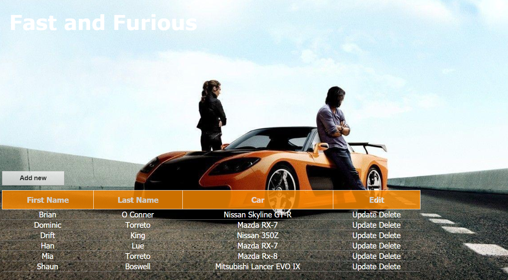

# customer-relationship-management
Spring MVC and Hibernate web app

## Description 
During the Spring&Hibernate course by Chad Darby, I've created simple bussines logic based on course and layout on r2_training branch.
The major object to me was to better understand all features using in project(MVC, adding, deleting, updating database),
acquaintanceship with new annotations and Facade Pattern.

## Technologies 
<ul>
  <li>Java</li>
  <li>Spring</li>
  <li>Hibernate</li>
  <li>MySQL</li>
</ul>

## Screenshoot

   

